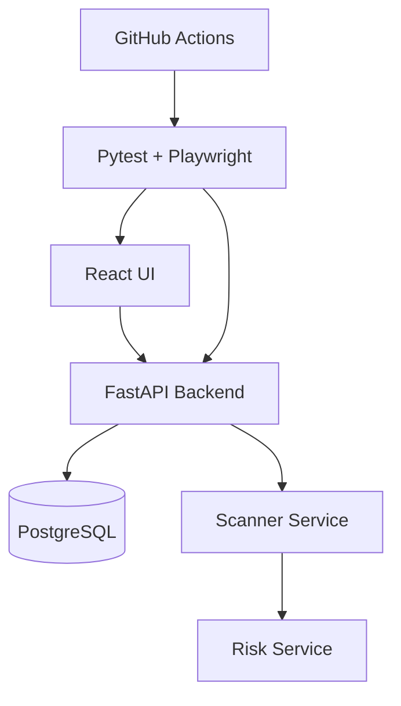

# VaroShield Mini Automation POC

## Why this project exists

This project was built as a mini Data Security automation POC. It simulates
sensitive data discovery, permission exposure, async scan processing, risk
alerting and dashboard validation — the kind of workflow a DSPM-style product
would run in production, scaled down to something a single engineer can build,
run, and test end to end.

## Architecture



## Business flow

Sensitive file → Permission exposure → Async scan → Risk alert → Dashboard update

1. Admin logs in
2. Admin creates a file with content and permissions
3. Admin starts a security scan
4. The system scans files asynchronously and classifies sensitive data
5. The system checks if sensitive files are exposed (public or shared with "everyone")
6. The system creates risk alerts (high / low / safe)
7. The dashboard shows a live summary of files, sensitive files, exposure and open alerts

### Risk rules

| Condition | Result |
|---|---|
| Sensitive file content (email / phone / credit card / secret keywords) + public access | **HIGH** risk |
| Sensitive file + shared with `everyone` group (read/write/admin) | **HIGH** risk |
| Non-sensitive file + public access | **LOW** risk |
| Sensitive file, private, accessible only by owner/admin | **SAFE** (no alert) |

## Tech stack

- **Backend**: FastAPI, Python 3.11+, SQLAlchemy, PostgreSQL, Pydantic, Uvicorn
- **Frontend**: React + Vite, TypeScript, plain CSS
- **Automation**: Pytest, Playwright (Python), Requests, Allure Pytest, pytest-xdist
- **Infra**: Docker, Docker Compose
- **CI**: GitHub Actions

## Test strategy

- API tests validate business logic: auth, file/permission CRUD, async scan
  lifecycle, and risk rules.
- UI tests validate critical user journeys only (login, dashboard summary,
  starting a scan, viewing and filtering risks) — they do not duplicate full
  API coverage.
- Async tests (scan jobs) use a `wait_until` polling utility with timeout
  instead of hard-coded sleeps, so the suite stays fast and stable.
- Risk tests validate sensitive-data detection and permission exposure
  together, since a risk alert is a function of both.
- CI runs the full stack via Docker Compose and uploads Allure results for
  fast, readable debugging.

## Repository structure

```
varoshield-mini/
  backend/        FastAPI app: models, schemas, services, routers
  frontend/       React + Vite + TypeScript UI
  automation/     Pytest + Playwright test framework (clients, page objects, tests)
  .github/        GitHub Actions workflow
  docker-compose.yml
```

## How to run locally

```bash
docker compose up -d --build
```

- Backend docs: http://localhost:8000/docs
- Frontend: http://localhost:3000

Seed users:

| Email | Password | Role |
|---|---|---|
| admin@example.com | admin123 | admin |
| user@example.com | user123 | user |

### Run automation

```bash
cd automation
pip install -r requirements.txt
playwright install
pytest --alluredir=allure-results
```

### View the Allure report

```bash
allure serve allure-results
```

## Demo script for interview

1. Open this README and walk through the architecture diagram
2. Start the app with `docker compose up -d --build`
3. Log in as admin
4. Create a sensitive file (e.g. content with an email + credit card number)
5. Expose it to the `everyone` group
6. Start a scan from the dashboard
7. Show the HIGH risk alert appear on the Risks page
8. Run the API tests: `pytest automation/tests/api -m api`
9. Run the UI tests: `pytest automation/tests/ui -m ui`
10. Show the Allure report: `allure serve allure-results`
11. Show the GitHub Actions workflow (`.github/workflows/automation-ci.yml`)

## Talking points for interview

- The product is intentionally small.
- The main value is the automation architecture, not the demo app.
- The API layer validates business logic; the UI layer validates critical
  user flows.
- The async scan is tested with polling, not hard sleeps.
- Permissions and sensitive data are tested together, since risk is a
  function of both.
- Reports include enough context (job id, file id, request/response) for
  fast debugging.
- Docker makes execution reproducible; CI gives release confidence.

## Interview pitch

Before the interview, I built a small POC that simulates a data-security
product. It detects sensitive files, validates permission exposure, creates
risk alerts and includes API, UI and async automation with Pytest,
Playwright, Docker and CI.

The main value is not the demo app itself. The main value is the automation
architecture: clear test layers, reusable clients, stable async validation,
permission-risk coverage, CI execution and readable reports.
