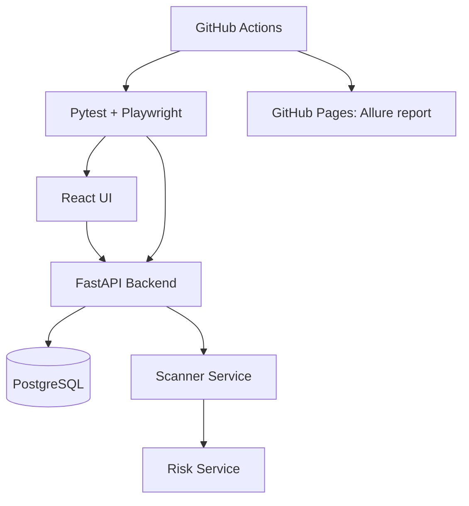

# DSPM Sentinel Mini Automation POC

## Why this project exists

This project was built as a mini Data Security automation POC. It simulates
sensitive data discovery, permission exposure, async scan processing, risk
alerting and dashboard validation — the kind of workflow a DSPM-style product
would run in production, scaled down to something a single engineer can build,
run, and test end to end.

## Architecture



## Business flow

Sensitive file → Permission exposure → Async scan → Risk alert → Dashboard update

1. Admin logs in
2. Admin creates a file with content and permissions
3. Admin starts a security scan
4. The system scans files asynchronously and classifies sensitive data
5. The system checks if sensitive files are exposed (public or shared with "everyone")
6. The system creates risk alerts (high / low / safe)
7. The dashboard shows a live summary of files, sensitive files, exposure and open alerts

### Risk rules

| Condition | Result |
|---|---|
| Sensitive file content (email / phone / credit card / secret keywords) + public access | **HIGH** risk |
| Sensitive file + shared with `everyone` group (read/write/admin) | **HIGH** risk |
| Non-sensitive file + public access | **LOW** risk |
| Sensitive file, private, accessible only by owner/admin | **SAFE** (no alert) |

## Tech stack

- **Backend**: FastAPI, Python 3.11+, SQLAlchemy, PostgreSQL, Pydantic, Uvicorn
- **Frontend**: React + Vite, TypeScript, plain CSS (Manrope / IBM Plex Sans / IBM Plex Mono type system, semantic status colors, dataviz-informed charts)
- **Automation**: Pytest, Playwright (Python), Requests, Allure Pytest, pytest-xdist
- **Infra**: Docker, Docker Compose
- **CI**: GitHub Actions (builds the stack, runs the suite, publishes the Allure report to GitHub Pages)

## Frontend highlights

- **Login page** doubles as a system map: two animated diagrams (business logic
  flow, test-automation layers) built straight from the repo's own architecture.
- **Dashboard** has a live posture breakdown (open alerts by severity, files by
  classification) as thin status-colored bar charts, plus a scan console with a
  Queued → Scanning → Complete step tracker, an animated progress bar, a live
  elapsed timer, and a results summary once a scan finishes.
- **Files / Risks** pages have dynamic filters (options derived from the data
  actually loaded, not hardcoded) and client-side pagination, newest-first.

## Test strategy

- API tests validate business logic: auth, file/permission CRUD, async scan
  lifecycle, and risk rules.
- UI tests validate critical user journeys only (login, dashboard summary,
  starting a scan, viewing and filtering risks) — they do not duplicate full
  API coverage.
- Async tests (scan jobs) use a `wait_until` polling utility with timeout
  instead of hard-coded sleeps, so the suite stays fast and stable.
- Risk tests validate sensitive-data detection and permission exposure
  together, since a risk alert is a function of both.
- CI runs the full stack via Docker Compose and uploads Allure results for
  fast, readable debugging.

## Testing layer, in depth

The automation framework (`automation/`) is the actual point of this
repository — the app underneath is intentionally small. This section walks
through how it's built, layer by layer.

### Folder layout

```
automation/
  clients/          One class per API resource, all sharing a base HTTP client
    base_client.py     Adds the bearer auth header, logs any non-2xx response
    auth_client.py      /auth/login
    files_client.py      /files, /files/{id}/permissions
    scan_client.py         /scan/start, /scan/{job_id}, plus a poll-to-completion helper
    risks_client.py          /risks
    dashboard_client.py       /dashboard/summary
  pages/             One Playwright page object per UI page (login, dashboard, files, risks)
  tests/
    api/             Business-logic coverage — auth, CRUD, scan lifecycle, risk rules
    ui/              Critical user journeys only — no duplicate API coverage
  utils/
    config.py         Central env-driven config (base URLs, seed tokens) — the only place that reads os.getenv
    polling.py         wait_until(): the one sanctioned way to wait on the async scan job
    test_data.py        Content generators (sensitive_content, safe_content) and unique_name()
    logger.py           Shared logger used by clients and tests
  conftest.py        Fixtures: base URLs, tokens, pre-wired clients, an authenticated Playwright page
  pytest.ini         Marker registry + test discovery config
```

### API clients: one class per resource, one base class for the plumbing

Every client subclasses `BaseClient`, which owns the two things every request
needs — the auth header and failure logging — so individual clients stay
tiny:

```python
class BaseClient:
    def _headers(self) -> dict:
        headers = {"Content-Type": "application/json"}
        if self.token:
            headers["Authorization"] = f"Bearer {self.token}"
        return headers

    def _request(self, method: str, path: str, **kwargs) -> requests.Response:
        response = requests.request(method, f"{self.base_url}{path}", headers=self._headers(), **kwargs)
        if response.status_code >= 400:
            logger.error("API call failed: %s %s -> %s %s", method, url, response.status_code, response.text)
        return response
```

`ScanClient` is the clearest example of why this pays off — it wraps the
raw endpoints *and* exposes a `start_scan_and_wait()` helper that hides the
polling loop entirely, so tests just call one method and get a finished job
back:

```python
@allure.step("Start scan and wait until it finishes")
def start_scan_and_wait(self, timeout: int = 60, interval: int = 2) -> dict:
    job = self.start_scan()
    return wait_until(
        action=lambda: self.get_scan_job(job["job_id"]),
        condition=lambda response: response["status"] in ("done", "failed"),
        timeout=timeout,
        interval=interval,
        error_message=f"Scan job {job['job_id']} did not finish",
    )
```

API tests call these clients directly — never raw `requests` — so every test
reads as business steps, not HTTP plumbing:

```python
@pytest.mark.api
@pytest.mark.risks
@pytest.mark.smoke
def test_sensitive_public_file_creates_high_risk(files_client, scan_client, risks_client):
    with allure.step("Create a public file with sensitive content"):
        file_item = files_client.create_file(name=unique_name("public-sensitive"), content=sensitive_content(), owner="finance", is_public=True)
    with allure.step("Run scan and wait for completion"):
        scan_client.start_scan_and_wait()
    with allure.step("Fetch risk alerts for the file"):
        risks = risks_client.get_risks(file_id=file_item["id"])
    assert risks[0]["severity"] == "high"
```

### Page objects: the UI equivalent, used only by `tests/ui`

Same idea, Playwright side. Each page object hides selectors behind named
methods, so a UI change only requires updating one file instead of every
test that touches that page:

```python
class LoginPage:
    def open(self) -> None:
        self.page.goto(f"{self.base_url}/login")

    def login(self, email: str, password: str) -> None:
        self.page.fill('[data-testid="login-email"]', email)
        self.page.fill('[data-testid="login-password"]', password)
        self.page.click('[data-testid="login-submit"]')
```

Selectors are always `data-testid` attributes, never CSS classes or text
content, so UI/CSS redesigns (the login page has had several) don't break
the suite.

### Fixtures (`conftest.py`): everything pre-wired, nothing constructed by hand in a test

- `api_base_url` / `ui_base_url` / `admin_token` / `user_token` — session-scoped,
  read once from `Config`.
- `files_client` (admin token) vs. `user_files_client` (user token) — the
  fixture name encodes *which role* the client acts as, so a permissions test
  reads as `user_files_client.create_file(...)` and the intent is obvious at
  the call site.
- `authenticated_page` — a Playwright `page` that's already "logged in":
  it navigates to `/login` and then injects the admin token/role straight
  into `localStorage`, instead of filling the login form. This is deliberate:
  the login *flow itself* is already covered by a dedicated UI test
  (`test_login.py`), so every other UI test gets straight to the page it
  actually wants to verify instead of re-proving login works dozens of times.

### Test data (`utils/test_data.py`)

`sensitive_content()` and `safe_content()` generate file bodies that either
do or don't trip the backend's real classification rules (an email address,
a credit-card-shaped number, a keyword like `ssn`/`secret`/`password` vs.
plain prose) — so a scan run against them produces a genuine, non-mocked
`risky`/`safe` split instead of a hard-coded fixture value. `unique_name()`
suffixes a random token onto file names so repeated runs against the same
database don't collide.

### Async handling: `wait_until`, never `time.sleep`

The scanner runs as a fire-and-forget background task with an artificial
delay, so every test that starts a scan needs to wait for it — and
`utils/polling.py` is the *only* sanctioned way to do that:

```python
def wait_until(action, condition, timeout=60, interval=2, error_message="Condition was not met"):
    deadline = time.monotonic() + timeout
    while time.monotonic() < deadline:
        last_result = action()
        if condition(last_result):
            return last_result
        time.sleep(interval)
    raise TimeoutError(f"{error_message}. Last result: {last_result}")
```

A fixed `time.sleep(N)` would either be too short (flaky) or too long
(slow) depending on machine load; polling with a timeout self-corrects for
both and fails loudly (with the last observed state attached) instead of
silently asserting against stale data.

### Markers: how tests are labeled, and how CI slices them

Registered in `pytest.ini`:

| Marker | Meaning |
|---|---|
| `api` | API-layer test |
| `ui` | UI-layer test (Playwright) |
| `smoke` | Fast, must-pass check used to gate CI |
| `regression` | Broader coverage, not required for the CI gate |
| `permissions` | Role/permission validation |
| `scan` | Async scan job lifecycle |
| `risks` | Risk-alert rule coverage |

Every test carries a layer marker (`api`/`ui`) plus zero or more feature
markers. CI doesn't run the whole suite — it runs two explicit slices:

```bash
pytest automation/tests/api -m "smoke or api"   # API smoke gate
pytest automation/tests/ui  -m "smoke or ui"    # UI smoke gate
```

A new test that forgets a marker simply won't run in CI's gate — a
deliberate trade-off that keeps the CI-required set small and fast while
still letting `pytest -m regression` (or no `-m` at all, locally) run
everything.

### Reporting: Allure, not print statements

Every client method and every test step is wrapped in `@allure.step(...)`,
so a failure shows the exact business action that failed ("Create a public
file with sensitive content" → "Run scan and wait for completion" → "Fetch
risk alerts for the file"), not a raw stack trace. Tests also `allure.attach(...)`
the actual response payloads (e.g. the risks list, the scanned file) so a
failure can be root-caused from the report alone, without re-running
anything locally. Severity levels (`BLOCKER`/`CRITICAL`/`NORMAL`) rank the
same failure list by business impact.

CI uploads the raw results as a build artifact on every run (`if: always()`,
so a failed run still produces a report), generates the HTML report via the
Allure CLI, and — only on a push to `main`, since a PR's merge ref can't be
added to the Pages environment's branch allow-list — publishes it to GitHub
Pages and links it from the job summary.

## Repository structure

```
varoshield-mini/
  backend/        FastAPI app: models, schemas, services, routers
  frontend/       React + Vite + TypeScript UI
  automation/     Pytest + Playwright test framework (clients, page objects, tests)
  .github/        GitHub Actions workflow
  CLAUDE.md       Guidance for AI coding agents working in this repo
  docker-compose.yml
```

## How to run locally

```bash
docker compose up -d --build
```

- Backend docs: http://localhost:8000/docs
- Frontend: http://localhost:3000

If those ports are already taken by something else on your machine, don't edit
`docker-compose.yml` (CI relies on 5432/8000/3000) — instead create a local,
gitignored `docker-compose.override.yml` remapping the host ports; `docker
compose` picks it up automatically. Use `!override` on the `ports:` key so it
replaces rather than merges with the base file's list:

```yaml
services:
  backend:
    ports: !override
      - "8010:8000"
```

Seed users:

| Email | Password | Role |
|---|---|---|
| admin@example.com | admin123 | admin |
| user@example.com | user123 | user |

### Run automation

```bash
cd automation
pip install -r requirements.txt
playwright install
pytest --alluredir=allure-results
```

### View the Allure report

```bash
allure serve allure-results
```

CI also generates the report and publishes it to GitHub Pages on every push to
`main` — no local Allure install needed to view the latest run:
https://rabinavidan.github.io/VaroShield-Mini/

## Demo script for interview

1. Open this README and walk through the architecture diagram
2. Start the app with `docker compose up -d --build`
3. Log in as admin — point out the two animated system-map diagrams on the
   login page (business logic flow, test-automation layers)
4. Create a sensitive file (e.g. content with an email + credit card number)
5. Expose it to the `everyone` group
6. Start a scan from the dashboard — watch the scan console's step tracker and
   progress bar, then the results summary and updated posture charts
7. Show the HIGH risk alert appear on the Risks page; try the severity/status
   filters and pagination
8. Run the API tests: `pytest automation/tests/api -m api`
9. Run the UI tests: `pytest automation/tests/ui -m ui`
10. Show the live Allure report (https://rabinavidan.github.io/VaroShield-Mini/)
    or run it locally: `allure serve allure-results`
11. Show the GitHub Actions workflow (`.github/workflows/automation-ci.yml`),
    including the Pages deploy step

## Talking points for interview

- The product is intentionally small.
- The main value is the automation architecture, not the demo app.
- The API layer validates business logic; the UI layer validates critical
  user flows.
- The async scan is tested with polling, not hard sleeps.
- Permissions and sensitive data are tested together, since risk is a
  function of both.
- Reports include enough context (job id, file id, request/response) for
  fast debugging.
- Docker makes execution reproducible; CI gives release confidence.
- The frontend isn't an afterthought either: a small dataviz-informed design
  system (status-colored charts with hover tooltips, a real progress/step
  tracker for the async scan) shows the same attention to detail on the UI
  side, not just the test layer.

## Interview pitch

Before the interview, I built a small POC that simulates a data-security
product. It detects sensitive files, validates permission exposure, creates
risk alerts and includes API, UI and async automation with Pytest,
Playwright, Docker and CI.

The main value is not the demo app itself. The main value is the automation
architecture: clear test layers, reusable clients, stable async validation,
permission-risk coverage, CI execution and readable reports.
